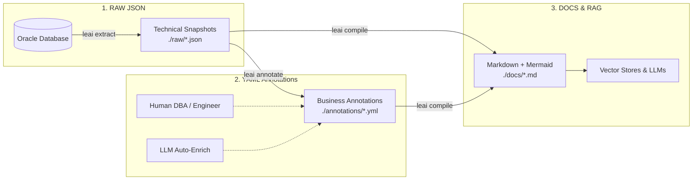

# LEAI — Oracle Database Intelligence & Documentation Engine

<div align="center">

[](https://lucasbral.github.io/leai/)
[](https://github.com/lucasbral/leai)
[](https://opensource.org/licenses/MIT)

**Official Bilingual Documentation:** [https://lucasbral.github.io/leai/](https://lucasbral.github.io/leai/) (English & Português)

</div>

**LEAI** (*Lê - Aí* in PT-BR) is an enterprise reverse engineering, impact analysis, and autonomous AI copilot engine for **Oracle Database**, specifically designed to power **Retrieval-Augmented Generation (RAG)**, **LLMs**, and software engineers maintaining complex database ecosystems.

---

> [!IMPORTANT]
> 🔒 **Security & Data Privacy Guarantee:**
>
> **LEAI NEVER accesses, reads, or extracts business data (table records or rows) stored in the database.**
> It strictly reads **data dictionary metadata and DDL definitions**: tables, column types, primary/foreign keys, views, materialized views, stored procedures, packages, triggers, indexes, and synonyms.
>
> 💡 **A database user with metadata-only / audit permissions (such as `SELECT ANY DICTIONARY` or read access to `ALL_*` catalog views) is 100% sufficient.** This ensures full enterprise security and compliance (LGPD / GDPR / SOC2) with zero risk of exposing confidential or sensitive business data.

---

## 📑 Table of Contents / Índice

- [📌 What Is It?](#-what-is-it)
- [⚙️ How It Works (Pipeline)](#️-how-it-works)
- [🤖 Autonomous Agent & Tool Calling Engine](#-autonomous-agent--tool-calling-engine)
- [🔗 Transparent Synonym Resolution](#-transparent-synonym-resolution)
- [✂️ PL/SQL Semantic Compression](#️-plsql-semantic-compression)
- [🚀 Quickstart: Using LEAI in Any Project](#-quickstart-using-leai-in-any-project)
- [📖 CLI Command Reference](#-cli-command-reference)
  - [1. Pipeline & Core Commands (`leai`, `extract`, `annotate`, `compile`, `doc`, `generate`)](#1-pipeline--core-commands)
  - [2. Impact Analysis & Lineage (`leai trace`)](#2-impact-analysis--lineage-leai-trace)
  - [3. AI Copilot & Chat (`leai ask`, `leai chat`, `leai models`, `leai enrich`)](#3-ai-copilot--chat)
  - [4. Interactive Web Studio (`leai serve`)](#4-interactive-web-studio-leai-serve)
  - [5. Specialized Subagents (`leai agent`)](#5-specialized-subagents-leai-agent)
  - [6. Autonomous Workflows (`leai workflow`)](#6-autonomous-workflows-leai-workflow)
  - [7. Business Rules & Canonical Glossary (`leai rule`)](#7-business-rules--canonical-glossary-leai-rule)
  - [8. GitOps Version Control (`leai git`)](#8-gitops-version-control-leai-git)
  - [9. S3 / SeaweedFS Distributed Storage (`leai seaweed`)](#9-s3--seaweedfs-distributed-storage-leai-seaweed)
  - [10. Maintenance & Diagnostics (`leai changes`, `leai init`, `leai doctor`)](#10-maintenance--diagnostics)
- [📁 Directory Structure](#-directory-structure)
- [🧪 Automated Testing](#-automated-testing)

---

## 📌 What Is It?

Enterprise Oracle databases accumulate years of business rules scattered across hundreds of tables, views, triggers, and massive PL/SQL packages (3,000 to 10,000+ lines of code).

Enabling developers or AI assistants to reliably understand such environments is challenging due to three main issues:
1. **Token Inefficiency & Hallucinations:** Sending entire monolithic packages into an LLM context is expensive, slow, and triggers attention degradation ("Lost in the Middle").
2. **Hidden Dependencies:** Altering a single column can silently break triggers, views, and procedures across multiple schemas.
3. **Synonyms and Aliases:** Stored procedures frequently access tables via private or public synonyms (`PUBLIC SYNONYM`), creating the false impression that referenced objects do not exist or belong elsewhere.

LEAI solves this by extracting the Oracle data dictionary, constructing a cross-schema dependency graph, and providing an autonomous multi-step reasoning agent with offline database tools.

---

## ⚙️ How It Works

LEAI operates via a **3-stage decoupled pipeline**:



---

## 🤖 Autonomous Agent & Tool Calling Engine

When running `leai chat` or `leai ask`, the assistant uses an autonomous **Tool-Calling Reasoning Loop** (`AgentExecutionEngine`) with up to 10 iterations per turn. Instead of guessing or hallucinating, the model invokes specialized in-memory database tools:

| Tool Name | Parameters | Purpose |
| :--- | :--- | :--- |
| **`search_database_objects`** | `query`, `object_type` | Global catalog search across tables, views, packages, procedures, and synonyms. |
| **`view_object_definition`** | `schema`, `object_name` | Retrieves technical DDL or PL/SQL body with surgical semantic compression. |
| **`trace_object_lineage`** | `object_name`, `depth` | Traces multi-level upstream dependencies and downstream consumers with risk rating. |
| **`get_glossary_terms`** | `term` | Queries team-defined business rules and canonical SQL predicates. |

---

## 🔗 Transparent Synonym Resolution

Stored procedures often access objects via `PUBLIC SYNONYM` or remote database links (`@dblink`). LEAI snapshots `ALL_SYNONYMS` and transparently dereferences every alias to its authentic physical entity, avoiding broken chains and LLM hallucinations.

---

## ✂️ PL/SQL Semantic Compression

For massive 10,000-line packages, LEAI extracts only the specific subprogram body requested while producing a lightweight signature skeleton of the rest of the package. This **reduces token consumption by up to 95%** while eliminating prompt distraction.

---

## 🚀 Quickstart: Using LEAI in Any Project

### Step 1: Install LEAI

```bash
# Via pip
pip install leai

# Or via uv (recommended)
uv tool install leai
# Or in an existing project
uv add leai
```

### Step 2: Initialize Configuration

```bash
leai init
```

Configure your `leai.yml`:

```yaml
dsn: "oracle://${DB_USER}:${DB_PASS}@${DB_HOST}:1521/${DB_SERVICE}"

schemas:
  - HR
  - SALES

rawPath: "./raw"
annotationsPath: "./annotations"
docPath: "./docs"

ai:
  default_provider: "openai"      # openai, gemini, anthropic, deepseek, qwen, ollama
  providers:
    openai:
      api_key: "${OPENAI_API_KEY}"
      model: "gpt-4o-mini"
    gemini:
      api_key: "${GEMINI_API_KEY}"
      model: "gemini-2.0-flash"
```

### Step 3: Run the Full Pipeline

```bash
# 1. Run complete pipeline (extract + annotate + compile)
leai

# 2. Trace impact of modifying a table
leai trace EMPLOYEES --depth 2

# 3. Launch interactive terminal copilot
leai chat

# 4. Or launch the Web Studio in browser
leai serve
```

---

## 📖 CLI Command Reference

### 1. Pipeline & Core Commands

#### `leai` (or `leai generate`)
Executes the full automated pipeline: technical extraction, business annotation synchronization, and final Markdown compilation.

| Flag / Option | Type | Default | Description |
| :--- | :--- | :--- | :--- |
| `-c`, `--config PATH` | Option | `leai.yml` | Configuration file path. |
| `-s`, `--schemas TEXT` | Option | From config | Specific schema(s) to process. |
| `-t`, `--object-types TEXT` | Option | From config | Filter object types (e.g., `-t tables -t packages`). |
| `--with-traces / --no-traces` | Flag | `True` | Include Mermaid dependency lineage and risk ratings. |
| `--rag-json`, `--rag` | Flag | `False` | Also exports structured JSON chunks for Vector DBs. |
| `-d`, `--depth INT` | Option | `1` | Traversal depth for dependency tree. |
| `--seaweed` | Flag | `False` | Routes metadata through remote S3/SeaweedFS storage. |
| `--no-cache` | Flag | `False` | 100% remote mode without local files. |
| `--force-upload` | Flag | `False` | Forces re-upload to storage, bypassing SHA-256 cache. |

```bash
leai -s HR -t tables -t packages --depth 2 --rag-json
```

#### `leai extract`
Extracts Oracle data dictionary definitions into raw JSON snapshots.

| Flag / Option | Type | Default | Description |
| :--- | :--- | :--- | :--- |
| `-c`, `--config PATH` | Option | `leai.yml` | Path to `leai.yml`. |
| `-s`, `--schemas TEXT` | Option | From config | Target schema(s). |
| `-t`, `--object-types TEXT` | Option | From config | Object categories to extract. |
| `-d`, `--days INT` | Option | `None` | **Incremental:** Extract only objects modified in the last N days via `LAST_DDL_TIME`. |
| `--seaweed` | Flag | `False` | Stream snapshots directly to S3. |
| `--no-cache` | Flag | `False` | Avoids saving files to local `rawPath`. |
| `--force-upload` | Flag | `False` | Forces overwrite in storage bucket. |

```bash
# Incremental extraction of objects modified in the last 30 days
leai extract --days 30
```

#### `leai annotate`
Synchronizes YAML business annotation stubs under `annotations/` without overwriting existing human notes.

| Flag / Option | Type | Default | Description |
| :--- | :--- | :--- | :--- |
| `-c`, `--config PATH` | Option | `leai.yml` | Path to `leai.yml`. |
| `-s`, `--schemas TEXT` | Option | From config | Target schema(s). |
| `-t`, `--object-types TEXT` | Option | From config | Object categories to synchronize. |
| `--seaweed` | Flag | `False` | Syncs annotations directly in S3. |
| `--no-cache` | Flag | `False` | Zero-cache remote execution. |

#### `leai doc <OBJECT>`
Opens the in-terminal interactive documentation editor for a specific database entity.

```bash
leai doc EMPLOYEES
leai doc PKG_BILLING
```

#### `leai compile`
Recompiles the final Markdown documentation in `docs/` with Mermaid.js diagrams.

| Flag / Option | Type | Default | Description |
| :--- | :--- | :--- | :--- |
| `-c`, `--config PATH` | Option | `leai.yml` | Path to `leai.yml`. |
| `-o`, `--object-name TEXT` | Option | `None` | Recompiles an isolated individual entity. |
| `-s`, `--schemas TEXT` | Option | From config | Target schema(s). |
| `-t`, `--object-types TEXT` | Option | From config | Filter object types. |
| `--with-traces / --no-traces` | Flag | `True` | Include Mermaid lineage graphs. |
| `--rag-json`, `--rag` | Flag | `False` | Export JSON chunks for Vector DBs. |
| `-d`, `--depth INT` | Option | `1` | Traversal depth for dependency tree. |
| `--seaweed` | Flag | `False` | Uses remote S3 snapshots. |
| `--no-cache` | Flag | `False` | Pure remote mode. |

---

### 2. Impact Analysis & Lineage (`leai trace`)

Generates multi-level upstream/downstream dependency trees, automated risk scores (`LOW`, `MEDIUM`, `HIGH`, `CRITICAL`), and Mermaid diagrams.

| Flag / Option | Type | Default | Description |
| :--- | :--- | :--- | :--- |
| `OBJECT` | Argument | **Required** | Target entity name to trace. |
| `-d`, `--depth INT` | Option | `1` | Maximum graph exploration depth. |
| `-s`, `--schema TEXT` | Option | `None` | Schema of the object when resolving ambiguous names. |
| `--offline` | Flag | `False` | **Offline Mode:** Resolves dependencies from local `raw/` without Oracle connection. |
| `-o`, `--output PATH` | Option | `None` | Custom path to save the generated Markdown dossier. |
| `--rag-json`, `--rag` | Flag | `False` | Exports structured JSON chunks for RAG. |
| `--seaweed` | Flag | `False` | Resolves metadata from remote S3. |
| `--no-cache` | Flag | `False` | Pure remote execution. |

```bash
leai trace CONTRACTS_TB --depth 3 --offline --output ./dossier.md
```

---

### 3. AI Copilot & Chat

#### `leai ask <QUESTION>`
Answers one-off natural language queries about database structure and business rules.

```bash
leai ask "Which procedures update customer status to INACTIVE?" -p gemini
```

#### `leai chat`
Launches the interactive terminal copilot console with conversation memory, syntax highlighting, and live tool execution.

| Flag / Option | Type | Default | Description |
| :--- | :--- | :--- | :--- |
| `-p`, `--provider TEXT` | Option | From config | Active AI provider. |
| `-m`, `--model TEXT` | Option | From config | Target AI model identifier. |
| `-c`, `--config PATH` | Option | `leai.yml` | Path to `leai.yml`. |
| `-w`, `--web` | Flag | `False` | Launches Web Studio server and opens chat in browser. |
| `--seaweed` | Flag | `False` | Resolves metadata from remote S3. |
| `--no-cache` | Flag | `False` | Pure in-memory execution. |

**In-Session Slash Commands:**
* `/copy [all|code|N]`: Copy response or code block directly to OS clipboard.
* `/doc [obj]`: In-terminal YAML annotation & documentation editor.
* `/enrich [obj]`: Auto-enrich business rules with LLM.
* `/compile [obj]`: Recompile Markdown docs (supports single object).
* `/trace <obj>`: Inline dependency & impact X-ray with Mermaid.
* `/tables`: List all catalog tables with column counts and primary keys.
* `/schema [s]`: Show full overview of schema objects.
* `/changes [d]`: Audit objects modified in last N days (Default: 7).
* `/models [p]`: List available AI models returned by provider API.
* `/audit [last|session|export]`: Inspect AI tool call trace and latency.
* `/tools`: Quick viewer for last turn's tool execution inputs/outputs.
* `/save [file.md]`: Export current conversation transcript to Markdown.

#### `leai enrich`
Invokes the LLM to inspect DDLs and draft automated business descriptions for undocumented entities.

```bash
leai enrich -o EMPLOYEES --overwrite -p gemini
```

#### `leai models`
Lists all configured AI providers, benchmarks network latency, and validates API keys.

---

### 4. Interactive Web Studio (`leai serve`)

Launches the visual **LEAI Web Documentation & Annotation Studio** daemon for in-browser collaborative annotation, instant Markdown compilation, and streaming AI copilot chat.

* **Real-time SeaweedFS S3 Sync:** Annotation edits in the browser (`POST /api/annotations`) are saved locally and synced directly to the S3 bucket in real time.
* **Remote Fallback:** Loads annotations directly from SeaweedFS S3 if not present on local disk.

| Flag / Option | Type | Default | Description |
| :--- | :--- | :--- | :--- |
| `--port` | Option | `8891` | TCP port for local server. |
| `--host` | Option | `127.0.0.1` | Network interface to bind. |
| `--open-browser / --no-open-browser` | Flag | `True` | Launches default browser on startup. |
| `-c`, `--config PATH` | Option | `leai.yml` | Path to configuration file. |
| `-p`, `--provider TEXT` | Option | From config | AI provider override. |

```bash
leai serve --host 0.0.0.0 --port 9000
```

---

### 5. Specialized Subagents (`leai agent`)

Executes isolated technical personas with restricted, laser-focused database toolsets:

* `leai agent list`: Lists registered subagents.
* `leai agent run <ROLE> <TASK>`: Executes a subagent.

| Subagent Role | Specialist Title | Focus & Permitted Tools |
| :--- | :--- | :--- |
| **`catalog_researcher`** | Catalog Researcher | Explores schema entities, synonyms, column types. Tools: `search`, `view`, `glossary`. |
| **`plsql_analyst`** | PL/SQL Analyst | Reverse engineers routines with semantic compression. Tools: `view`, `search`. |
| **`lineage_auditor`** | Lineage Auditor | Evaluates cascading risk and impact before refactoring. Tools: `trace`, `search`. |
| **`patch_generator`** | Patch Engineer | Generates zero-downtime DDL migration scripts and rollbacks. Tools: `view`, `trace`. |
| **`doc_annotator`** | Documentation Annotator | Generates domain-aligned business annotations. Tools: `view`, `glossary`. |

```bash
leai agent run plsql_analyst "Explain the interest calculation algorithm in PKG_BILLING"
```

---

### 6. Autonomous Workflows (`leai workflow`)

Multi-step orchestrated pipelines for high-risk engineering tasks:

* `leai workflow list`: Lists available workflows (`impact-analysis`, `safe-refactor`).
* `leai workflow run <NAME> <TARGET>`: Executes a workflow.

```bash
# Comprehensive impact dossier before modifying a table
leai workflow run impact CUSTOMERS_TB --output ./customers_impact.md

# Safe phased refactoring plan and DDL patch
leai workflow run refactor PKG_BILLING -p claude
```

---

### 7. Business Rules & Canonical Glossary (`leai rule`)

Codifies domain concepts and canonical SQL predicates so AI copilots generate accurate queries:

* `leai rule list`: Lists codified business rules.
* `leai rule add <TERM>`: Adds a canonical rule.
* `leai rule show <TERM>`: Displays rule specifications.

```bash
leai rule add "ACTIVE_CUSTOMER" \
  --table "CUSTOMERS_TB" \
  --canonical-filter "RECORD_STATUS = 'A' AND IS_LOCKED = 0" \
  --definition "Customers eligible to place orders and receive billing invoices" \
  --tags "sales,compliance"
```

---

### 8. GitOps Version Control (`leai git`)

Treats documentation as first-class code (**Docs-as-Code**):

* `leai git status [--fetch]`: Inspects repository status across tracked documentation paths.
* `leai git pull`: Pulls latest annotations from remote Git repository.
* `leai git sync [-m "message"]`: Stages, commits, and pushes modified annotations and docs.

```bash
leai git sync -m "docs(billing): update tax calculation business rules"
```

---

### 9. S3 / SeaweedFS Distributed Storage (`leai seaweed`)

Collaborative metadata persistence using S3-compatible Object Storage:

* `leai seaweed status`: Verifies S3 connection and bucket health.
* `leai seaweed push`: Uploads local snapshots to remote S3 bucket.
* `leai seaweed pull`: Downloads snapshots from remote S3 bucket.
* **Web Studio Integration:** Edits made in Web Studio (`/serve`) sync directly to SeaweedFS in real time.
* **Lifecycle Rules:** Compatible with standard S3 lifecycle configurations (`NoncurrentVersionExpiration` on `annotations/`) to purge old non-current versions automatically.

---

### 10. Maintenance & Diagnostics

* **`leai changes`**: Audits database objects modified in the last N days via Oracle's `LAST_DDL_TIME` (`-d`, `--days`, `-u`, `--user`).
* **`leai doctor`** (or `check`): Pre-flight verification of Oracle connectivity, catalog permissions, pipeline directories, and AI credentials.
* **`leai init`**: Generates a starter `leai.yml` (`-f`, `--force`, `-e`, `--example`).

---

## 📁 Directory Structure

```text
my_project/
├── leai.yml                  <-- Master configuration file
├── raw/                      <-- Raw technical JSON snapshots extracted from Oracle
│   └── HR.json
├── annotations/              <-- Human & AI business rules in YAML (non-destructive)
│   └── HR.yml
└── docs/                     <-- Final compiled Markdown documents for RAG and humans
    └── HR/
        ├── INDEX.md          <-- Master navigation index
        ├── tables/           <-- Tables with Mermaid diagrams and YAML frontmatter
        └── code_objects/     <-- Procedures, packages, functions, views
```

---

## 🧪 Automated Testing

To run the complete automated test suite:

```bash
# Run unit tests with test coverage reporting
uv run coverage run -m unittest discover tests
uv run coverage report -m

# Run code linter
uv run ruff check .
```

---

<div align="center">

**LEAI** — Built for Oracle Engineers, Enterprise RAG, and Autonomous AI Copilots.

</div>
