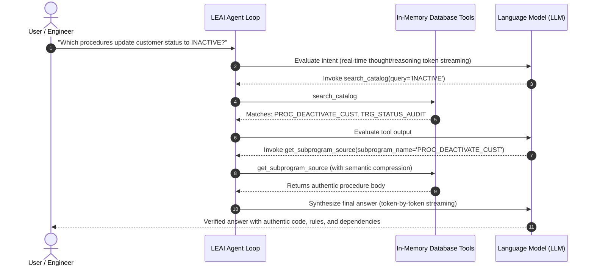

# Autonomous Agent & In-Memory Tools

LEAI features an autonomous reasoning engine based on the **ReAct (Reason + Act)** paradigm via its `AgentExecutionEngine`. Instead of guessing database structures or overwhelming prompt windows, the agent actively inspects catalog metadata in real time with thought/reasoning token streaming and in-memory tool calling.

---

## 🔄 How the Execution Loop Operates

The agent runs with a configurable safety guard of up to 10 reasoning cycles per turn to prevent infinite loops.

---

## ⚡ Real-Time Streaming & Thought/Reasoning Tokens

LEAI supports **synchronous and asynchronous streaming with Tool Calling** (`stream_chat_with_tools`) across all major LLM providers:
* **DeepSeek-R1 / Qwen 2.5 / Ollama**: Captures and emits `<think>` / `reasoning_content` blocks via the `on_thought` event.
* **Gemini (Google AI)**: Extracts native `thought: true` and `thoughtSignature` blocks via Server-Sent Events (SSE).
* **Anthropic Claude**: Processes native `thinking_delta` / `thinking` blocks and streams incremental tool arguments (`input_json_delta`).
* **Web Studio & CLI**: Live reasoning traces appear dynamically in terminal and web interfaces (`leai serve`) without blind spinner pauses.

---

## 🛠️ Available Agent Tools

| Tool | Parameters | Purpose |
| :--- | :--- | :--- |
| **`search_catalog`** | `query`, `object_types`, `schema` | Fast text and regex search across tables, views, procedures, packages, functions, and synonyms. |
| **`get_table_schema`** | `table_name`, `schema` | Comprehensive DDL inspection: data types, nullable constraints, PKs, FKs, unique keys, check constraints, and indexes. |
| **`get_subprogram_source`** | `package_name`, `subprogram_name` | Surgical extraction of standalone procedure/function or subprogram inside a package (with semantic compression). |
| **`grep_plsql_code`** | `pattern`, `object_name`, `schema` | Fast regex search across all stored PL/SQL bodies without reading entire packages. |
| **`trace_object_lineage`** | `object_name`, `schema`, `depth`, `direction` | Multi-level upstream/downstream dependency graph with automated refactoring risk score (`LOW` to `CRITICAL`). |
| **`explain_and_tune_sql`** | `sql_query`, `detailed` | Evaluates sargability (`TRUNC`, `NVL`, `UPPER`), Full Table Scan (FTS) risks, `NOT IN (SELECT ...)` NULL pitfalls, compound index ordering, and AI query rewrites. |
| **`validate_oracle_sql`** | `sql_query`, `target_schema` | Validates Oracle dialect compliance, blocks non-Oracle constructs (`LIMIT`, `BOOLEAN`, `ILIKE`, `IFNULL`, `+` concat), and checks against schema catalog. |
| **`lookup_business_term`** | `query`, `tag` | Searches domain glossary for canonical business definitions, calculation rules, and canonical SQL predicates. |
| **`estimate_query_cost`** | `sql_query` | Estimates query complexity and relative execution cost. |
| **`query_schema_metadata`** | `schema_name` | Retrieves aggregated object counts and schema summaries. |

---

## 💡 Benefits of Offline Tool-Calling

1. **Zero Access to Live Data:** Tools query the extracted metadata snapshot, ensuring data privacy and enterprise compliance (GDPR/LGPD/SOC2).
2. **Eliminates Hallucinations:** The model confirms facts by reading verified DDLs and code before forming its response.
3. **Token Efficiency:** Only relevant subprograms and table definitions enter the prompt window.
