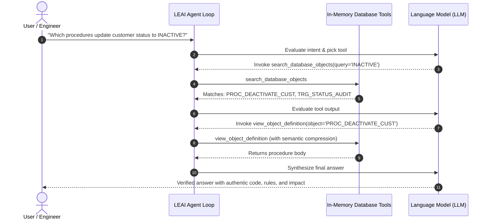

# Autonomous Agent & In-Memory Tools

LEAI features an autonomous reasoning engine based on the **ReAct (Reason + Act)** paradigm via its `AgentExecutionEngine`. Instead of guessing database structures or overwhelming prompt windows, the agent actively inspects catalog metadata in real time.

---

## 🔄 How the Execution Loop Operates

The agent runs with a configurable safety guard of up to 10 reasoning cycles per turn to prevent infinite loops.

---

## 🛠️ Available Agent Tools

| Tool | Parameters | Purpose |
| :--- | :--- | :--- |
| **`search_database_objects`** | `query`, `object_type` | Global catalog search across tables, views, procedures, packages, and synonyms. |
| **`view_object_definition`** | `schema`, `object_name` | Retrieves technical DDL or PL/SQL body with surgical semantic compression. |
| **`trace_object_lineage`** | `object_name`, `depth` | Computes upstream dependencies and downstream impact with risk scoring. |
| **`get_glossary_terms`** | `term` | Queries domain glossary concepts defined by the engineering team. |

---

## 💡 Benefits of Offline Tool-Calling

1. **Zero Access to Live Data:** Tools query the extracted metadata snapshot, ensuring data privacy and enterprise compliance.
2. **Eliminates Hallucinations:** The model confirms facts by reading verified DDLs and code before forming its response.
3. **Token Efficiency:** Only relevant subprograms and table definitions enter the prompt window.
