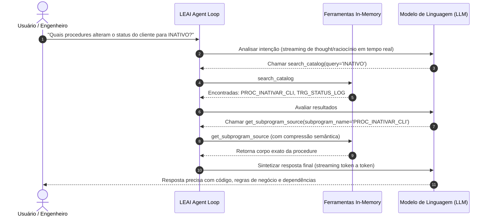

# Agente Autônomo e Ferramentas In-Memory

O LEAI incorpora um motor autônomo de raciocínio baseado no padrão **ReAct (Reason + Act)** através da classe `AgentExecutionEngine`. Em vez de tentar "adivinhar" estruturas de banco de dados ou depender de contexto estático, o agente investiga o catálogo em tempo real com streaming de raciocínio e execução de ferramentas in-memory.

---

## 🔄 Como Funciona o Loop de Execução

O agente possui um limite de segurança de até 10 iterações por turno para evitar loops infinitos.

---

## ⚡ Streaming em Tempo Real & Tokens de Raciocínio (Thought)

O LEAI suporta **streaming síncrono e assíncrono com Tool Calling** (`stream_chat_with_tools`) para os principais provedores:
* **DeepSeek-R1 / Qwen 2.5 / Ollama**: Captura e transmite blocos `<think>` / `reasoning_content` via evento `on_thought`.
* **Gemini (Google AI)**: Extrai partes estruturadas `thought: true` e `thoughtSignature` com SSE.
* **Anthropic Claude**: Processa blocos nativos `thinking_delta` / `thinking` e reconstrói incrementalmente os argumentos de ferramentas (`input_json_delta`).
* **Web Studio & CLI**: O terminal e o estúdio web (`leai serve`) exibem o raciocínio do modelo instantaneamente sem telas travadas ou spinners cegos.

---

## 🛠️ Ferramentas Disponíveis ao Agente

| Ferramenta | Parâmetros | Finalidade |
| :--- | :--- | :--- |
| **`search_catalog`** | `query`, `object_types`, `schema` | Busca rápida por texto e regex em tabelas, views, procedures, pacotes, funções e sinônimos. |
| **`get_table_schema`** | `table_name`, `schema` | Inspeção completa de DDL: tipos de dados, nulabilidade, PKs, FKs, Unique Keys, Checks e Índices. |
| **`get_subprogram_source`** | `package_name`, `subprogram_name` | Extração cirúrgica de procedure/function avulsa ou subprograma dentro de pacote (com compressão semântica). |
| **`grep_plsql_code`** | `pattern`, `object_name`, `schema` | Busca regex ultrarrápida no corpo de código PL/SQL sem sobrecarregar a janela de contexto. |
| **`trace_object_lineage`** | `object_name`, `schema`, `depth`, `direction` | Grafo de dependências upstream/downstream em múltiplos níveis com score de risco (`LOW` a `CRITICAL`). |
| **`explain_and_tune_sql`** | `sql_query`, `detailed` | Avaliação de sargabilidade (`TRUNC`, `NVL`, `UPPER`), risco de Full Table Scan (FTS), armadilhas de `NOT IN (SELECT ...)` com NULL, ordenação de índices compostos e propostas de reescrita otimizada. |
| **`validate_oracle_sql`** | `sql_query`, `target_schema` | Validador estrito de sintaxe Oracle: bloqueia padrões de MySQL/PostgreSQL (`LIMIT`, `BOOLEAN`, `ILIKE`, `IFNULL`, `+` concat) e valida colunas/tabelas contra os metadados. |
| **`lookup_business_term`** | `query`, `tag` | Consulta o glossário canônico de regras de negócio, filtros SQL canônicos e status organizacionais. |
| **`estimate_query_cost`** | `sql_query` | Estima a complexidade e custo relativo de execução de uma consulta SQL. |
| **`query_schema_metadata`** | `schema_name` | Recupera totais agregados e visão panorâmica de objetos de um schema. |

---

## 💡 Vantagens do Raciocínio Offline com Ferramentas

1. **Zero Acesso a Dados Reais:** As ferramentas operam exclusivamente sobre o snapshot de metadados extraídos, garantindo conformidade com a LGPD/GDPR e políticas corporativas.
2. **Alta Fidelidade:** O modelo só responde após inspecionar o código fonte real de procedures e colunas, eliminando alucinações.
3. **Eficiência de Contexto:** Apenas as informações estritamente necessárias são carregadas na memória durante o diálogo.
