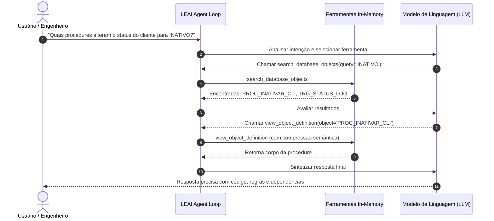

# Agente Autônomo e Ferramentas In-Memory

O LEAI incorpora um motor autônomo de raciocínio baseado no padrão **ReAct (Reason + Act)** através da classe `AgentExecutionEngine`. Em vez de tentar "adivinhar" estruturas de banco de dados ou depender de contexto estático, o agente investiga o catálogo em tempo real.

---

## 🔄 Como Funciona o Loop de Execução

O agente possui um limite de segurança de até 10 iterações por turno para evitar loops infinitos.

---

## 🛠️ Ferramentas Disponíveis ao Agente

| Ferramenta | Parâmetros | Finalidade |
| :--- | :--- | :--- |
| **`search_database_objects`** | `query`, `object_type` | Busca global no catálogo por tabelas, views, procedures, pacotes ou sinônimos. |
| **`view_object_definition`** | `schema`, `object_name` | Recupera a DDL ou código fonte com compressão semântica cirúrgica. |
| **`trace_object_lineage`** | `object_name`, `depth` | Executa análise de dependências upstream e downstream com avaliação de risco. |
| **`get_glossary_terms`** | `term` | Consulta o glossário de negócios e termos de domínio definidos pela equipe. |

---

## 💡 Vantagens do Raciocínio Offline com Ferramentas

1. **Sem Acesso Direto a Dados:** As ferramentas operam exclusivamente sobre o snapshot de metadados extraídos, garantindo conformidade com políticas de segurança de dados.
2. **Alta Fidelidade:** O modelo só responde após inspecionar o código fonte real de procedures e colunas, eliminando alucinações.
3. **Eficiência de Contexto:** Apenas as informações estritamente necessárias são carregadas na memória durante o diálogo.
