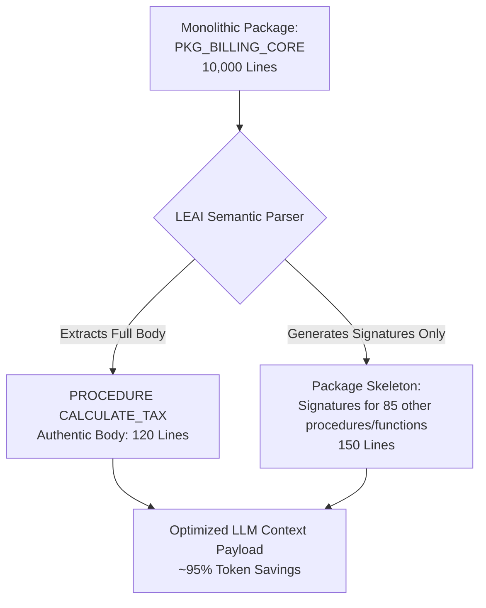

# PL/SQL Semantic Compression

Enterprise databases frequently contain business logic concentrated inside massive monolithic PL/SQL packages spanning 3,000 to over 10,000 lines of code.

Passing an entire 10,000-line package body into an LLM context creates three severe bottlenecks:
1. **Excessive Cost:** Thousands of prompt tokens consumed per single query.
2. **High Latency:** Model completion times multiply significantly.
3. **Attention Degradation (*Lost in the Middle*):** LLMs struggle to maintain focus and exhibit hallucinations when submerged in huge blocks of unrelated code.

---

## ✂️ The LEAI Solution: Surgical Skeletonization

LEAI includes a custom AST/PL-SQL semantic parser. When a user or autonomous agent inspects a specific procedure inside a large package:

### What is delivered to the LLM:
1. **The Target Subprogram:** Complete body, algorithmic logic, local variables, and SQL queries.
2. **The Surrounding Skeleton:** Lightweight signatures (header signatures with parameters and return types) of other routines in the package, preserving global contextual awareness without the noise.

---

## 📊 Efficiency Benchmark

| Metric | Raw Package Dump | With LEAI Compression | Savings |
| :--- | :--- | :--- | :--- |
| **Lines in Prompt** | ~10,000 lines | ~270 lines | **-97%** |
| **Token Consumption** | ~85,000 tokens | ~2,200 tokens | **-97.4%** |
| **Response Latency** | 12 to 25 seconds | 1 to 3 seconds | **8x faster** |
| **Reasoning Accuracy** | Moderate (hallucination prone) | High (laser-focused) | **Substantial boost** |
