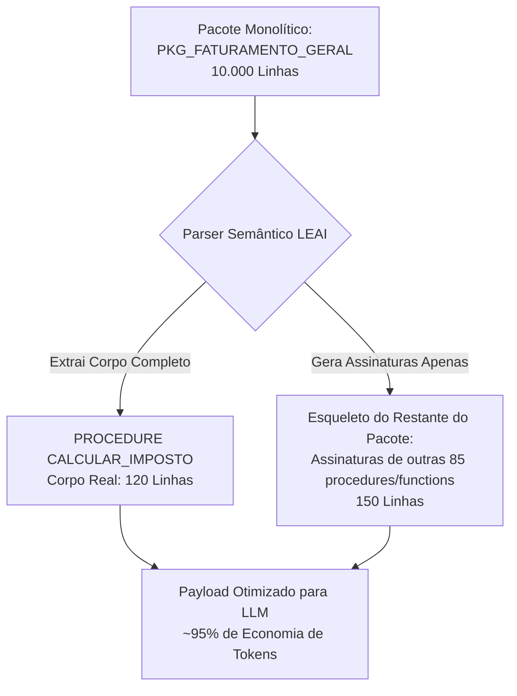

# Compressão Semântica de PL/SQL

Bancos de dados legados e corporativos acumulam regras de negócio complexas distribuídas em pacotes (packages) monolíticos de 3.000 a mais de 10.000 linhas de código PL/SQL.

Tentar injetar um pacote inteiro de 10.000 linhas no prompt de uma LLM gera três problemas críticos:
1. **Custo astronômico:** Milhares de tokens de entrada para cada interação.
2. **Latência elevada:** Aumenta o tempo de resposta da IA em várias vezes.
3. **Degradação de Atenção (*Lost in the Middle*):** Modelos de linguagem perdem precisão quando submetidos a prompts gigantescos com dezenas de procedimentos irrelevantes.

---

## ✂️ A Solução do LEAI: Esqueletização Cirúrgica

O LEAI implementa um parser semântico específico para PL/SQL. Quando um usuário ou agente solicita informações sobre uma procedure específica dentro de um pacote monolítico:

### O que é entregue à LLM:
1. **O subprograma alvo:** Com corpo completo, lógica interna, variáveis locais e cursores.
2. **O esqueleto circundante:** Apenas as assinaturas (cabeçalhos de entrada/saída) das demais procedures e functions do pacote, preservando o contexto global sem o ruído do código desnecessário.

---

## 📊 Comparativo de Eficiência

| Métrica | Envio Tradicional (Bruto) | Com Compressão do LEAI | Economia |
| :--- | :--- | :--- | :--- |
| **Linhas no Prompt** | ~10.000 linhas | ~270 linhas | **-97%** |
| **Consumo de Tokens** | ~85.000 tokens | ~2.200 tokens | **-97.4%** |
| **Tempo de Resposta** | 12 a 25 segundos | 1 a 3 segundos | **8x mais rápido** |
| **Precisão da Resposta** | Moderada (risco de alucinação) | Alta (foco exato no alvo) | **Melhoria substantiva** |
