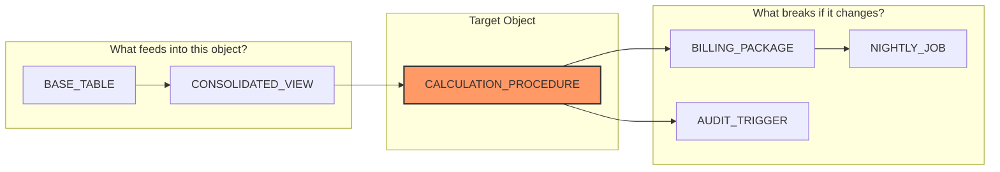

# Lineage Graph & Impact Analysis

Modifying a table or column in enterprise databases is often one of the riskiest tasks in software engineering. A seemingly harmless rename can invalidate views, break procedures across external schemas, and trigger silent failures.

**LEAI** addresses this challenge by compiling a cross-schema dependency graph and providing automated impact analysis.

---

## 🔍 How Lineage Tracing Works

The `leai trace <OBJECT>` command inspects both directions:



* **Upstream (Ancestors):** Which tables, views, and synonyms supply data or logic to this entity.
* **Downstream (Descendants):** Which views, packages, triggers, and procedures will fail if this entity's signature or structure changes.

---

## 🚦 Automated Risk Scoring

For every traced object, LEAI calculates an automated impact severity score based on the count and criticality of downstream dependents:

| Risk Level | Visual Indicator | Typical Criteria |
| :--- | :--- | :--- |
| **`LOW`** | 🟢 Green | Leaf entity with zero downstream dependents (or a single simple view). |
| **`MEDIUM`** | 🟡 Yellow | Moderate dependents (2 to 4), without mission-critical triggers or monolithic packages. |
| **`HIGH`** | 🟠 Orange | Multiple materialized views, core packages, or cross-schema dependencies. |
| **`CRITICAL`** | 🔴 Red | High-traffic hub object with dozens of downstream consumers, cascading triggers, or vital financial packages. |

---

## 💻 CLI Usage Example

```bash
leai trace CONTRACTS_TB --depth 3
```

LEAI outputs:
1. A formatted summary table with calculated risk rating and total affected entities.
2. The hierarchical list of upstream and downstream dependencies.
3. The corresponding Mermaid.js diagram ready to embed into documents or PR reviews.
