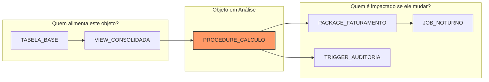

# Grafo de Linhagem e Análise de Impacto

Modificar uma coluna ou tabela em bancos de dados relacionais corporativos é frequentemente uma das tarefas mais arriscadas da engenharia de software. Uma alteração aparentemente inofensiva pode invalidar views, quebrar procedures em pacotes de terceiros e falhar triggers silenciosamente.

O **LEAI** resolve esse problema construindo um grafo de dependências cruzadas entre schemas e oferecendo análise de impacto automatizada.

---

## 🔍 Como Funciona o Rastreamento de Linhagem

O comando `leai trace <OBJETO>` analisa duas direções:



* **Upstream (Ancestrais):** Quais tabelas, views e sinônimos alimentam a lógica deste objeto.
* **Downstream (Descendentes):** Quais objetos, triggers, views e procedures quebram se a assinatura ou estrutura deste objeto for alterada.

---

## 🚦 Cálculo Automático de Risco

Para cada análise de impacto, o LEAI calcula automaticamente um indicador de severidade baseado no número e tipo de dependentes downstream:

| Nível de Risco | Cor / Indicador | Critério Típico |
| :--- | :--- | :--- |
| **`LOW`** | 🟢 Verde | Objeto folha sem dependentes downstream diretos (ou apenas 1 view simples). |
| **`MEDIUM`** | 🟡 Amarelo | Poucos objetos dependentes (2 a 4), sem triggers críticos ou pacotes centrais. |
| **`HIGH`** | 🟠 Laranja | Múltiplas views materializadas, pacotes corporativos ou dependências entre schemas diferentes. |
| **`CRITICAL`** | 🔴 Vermelho | Objeto central com dezenas de dependentes downstream, triggers em cascata ou referências em pacotes vitais. |

---

## 💻 Exemplo de Uso no CLI

```bash
leai trace TB_CONTRATOS --depth 3
```

O LEAI exibirá na saída do terminal:
1. Um resumo em tabela com os níveis de risco e total de objetos afetados.
2. A lista hierárquica de dependências upstream e downstream.
3. O diagrama Mermaid correspondente pronto para ser copiado ou visualizado.
