# The 3-Stage Decoupled Pipeline

The architectural core of **LEAI** is organized around a 3-stage decoupled pipeline. This separation guarantees that technical catalog extractions, human business notes, and AI-generated artifacts never overwrite or corrupt each other.

---

## 🏗️ High-Level Pipeline Architecture

```mermaid
flowchart TD
    subgraph S1 [1. Technical Layer: RAW]
        DB[(Oracle Database)] -->|leai extract| RAW[JSON Snapshots<br/>./raw/*.json]
    end

    subgraph S2 [2. Semantic Layer: ANNOTATIONS]
        RAW -->|leai annotate| YAML[Business Annotations<br/>./annotations/*.yml]
        HUMAN[Engineer / DBA] -.->|Manual edit| YAML
        AI[LLM / leai enrich] -.->|Auto-fill stubs| YAML
    end

    subgraph S3 [3. Consumption Layer: DOCS]
        RAW & YAML -->|leai compile| DOCS[Markdown Docs<br/>./docs/*.md]
        DOCS --> RAG[Vector DBs & RAG]
        DOCS --> COPILOT[leai ask & chat]
        DOCS --> WIKI[GitHub / Wikis]
    end
```

---

## 1. Extraction Stage (`raw`)

* **Command:** `leai extract`
* **Format:** Structured JSON files under `./raw/`.
* **Contents:** Pure technical metadata from Oracle's data dictionary:
  * Table names, columns, data types (`VARCHAR2`, `NUMBER`, `TIMESTAMP`), nullability, and default values.
  * Primary keys (PK), foreign keys (FK), and referenced target entities.
  * Complete source code and DDLs for views, procedures, functions, packages, and triggers.
  * Mapping of private and public synonyms (`ALL_SYNONYMS`).
* **Security:** Exclusively queries system catalog views (`ALL_TAB_COLUMNS`, `ALL_CONSTRAINTS`, `ALL_SOURCE`, etc.). **Never** reads table row data.

---

## 2. Annotation Stage (`annotations`)

* **Command:** `leai annotate` (and `leai enrich`)
* **Format:** Human-editable YAML files under `./annotations/`.
* **Purpose:**
  * Generates stubs for business descriptions, rules, and semantic tags.
  * **Idempotent Non-Destructive Merging:** If a developer or DBA writes notes for a column, subsequent runs of `leai annotate` **preserve** existing edits and only add newly discovered columns or objects.
  * The `leai enrich` command can invoke an LLM to automatically populate empty stubs based on column names and technical schemas.

---

## 3. Compilation Stage (`docs`)

* **Command:** `leai compile`
* **Format:** Markdown files with YAML Frontmatter under `./docs/`.
* **Features:**
  * **YAML Frontmatter:** Structured metadata headers for precise chunking and vector database ingestion.
  * **Embedded Mermaid.js:** Visual entity relationships and lineage diagrams rendered natively.
  * **Unified Documentation:** Merges technical schema definitions with business annotations.
