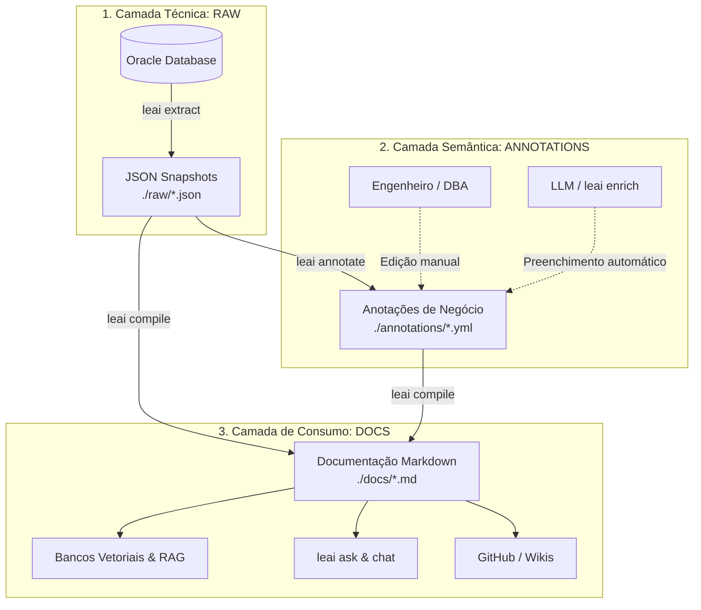

# O Pipeline Desacoplado em 3 Fases

O núcleo arquitetural do **LEAI** é estruturado em torno de um pipeline de 3 estágios desacoplados. Essa separação garante que a extração técnica, a documentação humana de negócio e os artefatos de IA nunca se sobreponham ou se destruam mutuamente.

---

## 🏗️ Diagrama Geral do Pipeline

---

## 1. Fase de Extração (`raw`)

* **Comando:** `leai extract`
* **Formato:** Arquivos JSON estruturados sob `./raw/`.
* **Conteúdo:** Metadados puros do dicionário de dados da Oracle:
  * Nomes de tabelas, colunas, tipos de dados (`VARCHAR2`, `NUMBER`, `TIMESTAMP`), anulabilidade e valores default.
  * Chaves primárias (PK), chaves estrangeiras (FK) e tabelas referenciadas.
  * Código fonte e DDL completo de views, procedures, functions, packages e triggers.
  * Mapeamento de sinônimos privados e públicos (`ALL_SYNONYMS`).
* **Segurança:** Apenas lê views de catálogo (`ALL_TAB_COLUMNS`, `ALL_CONSTRAINTS`, `ALL_SOURCE`, etc.). **Nunca** lê registros das tabelas.

---

## 2. Fase de Anotação (`annotations`)

* **Comando:** `leai annotate` (e `leai enrich`)
* **Formato:** Arquivos YAML legíveis por humanos sob `./annotations/`.
* **Proposta:**
  * Quando o comando é executado, ele gera esqueletos contendo campos para descrições de tabelas, colunas e regras de negócio.
  * **Idempotência e Não-Sobrescrita:** Se um desenvolvedor ou DBA preencher a descrição de uma coluna no YAML, futuras execuções de `leai annotate` **preservam** as edições existentes e apenas adicionam novas colunas ou tabelas que surgirem no banco.
  * O comando `leai enrich` pode utilizar uma LLM para sugerir descrições automáticas para stubs vazios com base nos tipos e nomes.

---

## 3. Fase de Compilação (`docs`)

* **Comando:** `leai compile`
* **Formato:** Arquivos Markdown com YAML Frontmatter sob `./docs/`.
* **Recursos gerados:**
  * **YAML Frontmatter:** Metadados estruturados no topo de cada arquivo Markdown para permitir segmentação cirúrgica e indexação em bancos vetoriais.
  * **Diagramas Mermaid.js:** Diagramas visuais de relacionamentos e linhagem inseridos diretamente no Markdown.
  * **Documentação Unificada:** Combina os metadados técnicos extraídos da fase 1 com as anotações de negócio da fase 2.
