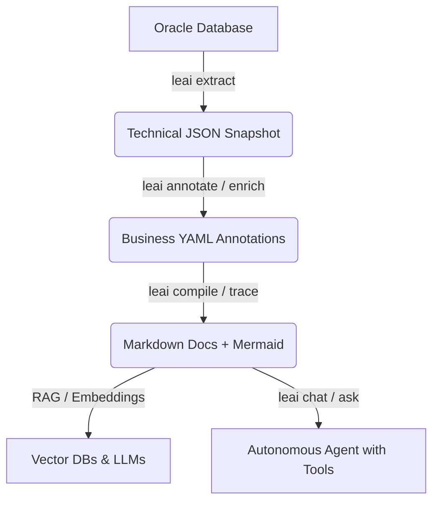

# LEAI — Oracle Database Intelligence & Documentation Engine

**LEAI** (*Lê - Aí* in PT-BR) is an enterprise reverse engineering, impact analysis, and autonomous AI copilot engine for **Oracle Database**, specifically designed to power **Retrieval-Augmented Generation (RAG)**, **LLMs**, and software engineers maintaining complex database ecosystems.

---

> [!IMPORTANT]
> 🔒 **Security & Data Privacy Guarantee:**
>
> **LEAI NEVER accesses, reads, or extracts business data (table records or rows) stored in the database.**
> It strictly reads **data dictionary metadata and DDL definitions**: tables, column types, primary/foreign keys, views, materialized views, stored procedures, packages, triggers, indexes, and synonyms.
>
> 💡 **A database user with metadata-only / audit permissions (such as `SELECT ANY DICTIONARY` or read access to `ALL_*` catalog views) is 100% sufficient.** This ensures full enterprise security and compliance (LGPD / GDPR / SOC2) with zero risk of exposing confidential or sensitive business data.

---

## 🌟 Core Highlights

* **3-Stage Decoupled Pipeline:** Clean separation between technical DDL extraction, human/AI business enrichment, and final Markdown compilation.
* **Multi-Level Lineage Tracing (`trace`):** Identifies upstream dependencies and downstream consumers with configurable depth and automated risk calculation (`LOW`, `MEDIUM`, `HIGH`, `CRITICAL`).
* **Transparent Synonym Resolution:** Automatically resolves `ALL_SYNONYMS` and `PUBLIC SYNONYMS` directly to their underlying physical target objects and database links (`@dblink`).
* **PL/SQL Semantic Compression:** Reduces token consumption by up to **95%** by isolating requested procedures and generating lightweight signature skeletons of monolithic packages.
* **Autonomous Reasoning Agent with Tool-Calling:** Multi-step loop with in-memory offline database tools (`search_database_objects`, `view_object_definition`, `trace_object_lineage`, etc.) to eliminate hallucinations.
* **Native Multi-Provider AI Support:** Out-of-the-box HTTPS REST integrations with OpenAI, Google Gemini, Anthropic Claude, DeepSeek, Qwen, Kimi, and Ollama (local & free).

---

## 🚀 Quick Navigation

* [Installation Guide](getting-started/installation.md)
* [Quickstart](getting-started/quickstart.md)
* [Configuration (leai.yml)](getting-started/configuration.md)
* [CLI Reference](cli-reference/overview.md)
* [Autonomous Agent and RAG](ai-and-rag/autonomous-agent.md)
