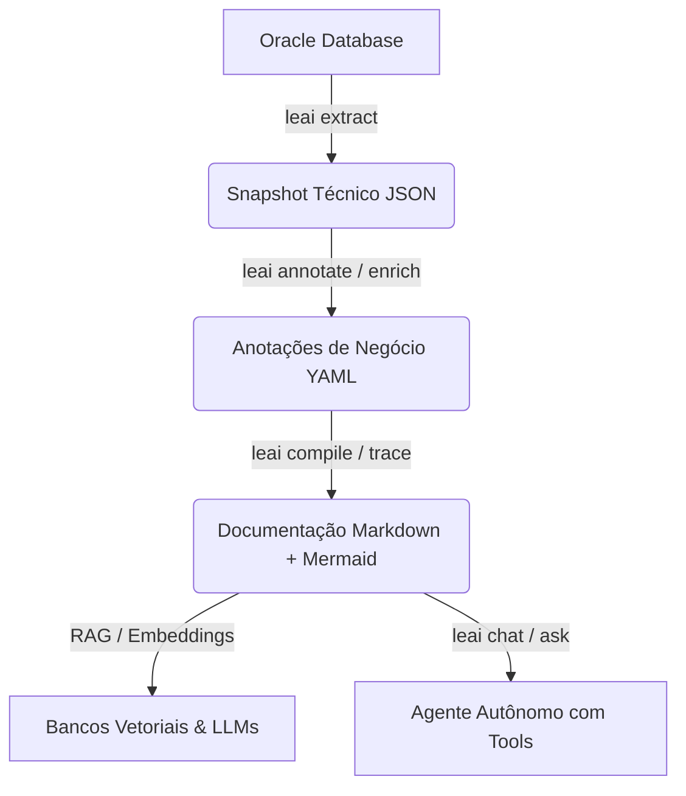

# LEAI — Motor de Inteligência e Documentação para Oracle Database

**LEAI** (*Lê - Aí*) é um motor empresarial de engenharia reversa, análise de impacto e copilot autônomo com IA para **Oracle Database**, projetado especificamente para alimentar **RAG (Retrieval-Augmented Generation)**, **LLMs** e desenvolvedores que mantêm ecossistemas legados ou complexos de banco de dados.

---

> [!IMPORTANT]
> 🔒 **Garantia de Segurança e Privacidade de Dados:**
>
> **O LEAI NUNCA acessa, lê ou extrai dados de negócio (registros ou linhas de tabelas) armazenados no banco de dados.**
> Ele lê estritamente os **metadados do dicionário de dados e definições DDL**: tabelas, colunas, tipos de dados, chaves primárias e estrangeiras, views, materialized views, pacotes (packages), stored procedures, triggers, índices e sinônimos.
>
> 💡 **Um usuário de banco com permissões de somente leitura no catálogo/metadados (como `SELECT ANY DICTIONARY` ou leitura nas views `ALL_*`) é 100% suficiente.** Isso assegura conformidade total com LGPD, GDPR e SOC2 com risco zero de vazamento de dados confidenciais.

---

## 🌟 Principais Recursos

* **Pipeline Desacoplado em 3 Fases:** Separação estrita entre extração técnica de DDLs, enriquecimento semântico de negócio e compilação para Markdown com frontmatter.
* **Rastreamento de Linhagem Multi-Nível (`trace`):** Identifica dependências upstream e consumidores downstream com profundidade configurável e cálculo de risco (`LOW`, `MEDIUM`, `HIGH`, `CRITICAL`).
* **Resolução Transparente de Sinônimos:** Resolve automaticamente `ALL_SYNONYMS` e `PUBLIC SYNONYMS` para os objetos físicos reais, pacotes e links de banco (`@dblink`).
* **Compressão Semântica de PL/SQL:** Reduz o consumo de tokens em até **95%** através do isolamento cirúrgico de subprogramas e esqueletização de pacotes monolíticos.
* **Agente Autônomo com Tool-Calling:** Raciocínio multi-etapas com ferramentas in-memory (`search_database_objects`, `view_object_definition`, `trace_object_lineage`, etc.) para responder perguntas complexas sem alucinação.
* **Multi-Provedor Nativo de LLM:** Suporte a OpenAI (ChatGPT), Google Gemini, Anthropic Claude, DeepSeek, Qwen, Kimi e Ollama (local e gratuito).

---

## 🚀 Navegação Rápida

* [Guia de Instalação](getting-started/installation.md)
* [Guia Rápido (Quickstart)](getting-started/quickstart.md)
* [Configuração do leai.yml](getting-started/configuration.md)
* [Referência dos Comandos CLI](cli-reference/overview.md)
* [Agente Autônomo e RAG](ai-and-rag/autonomous-agent.md)
