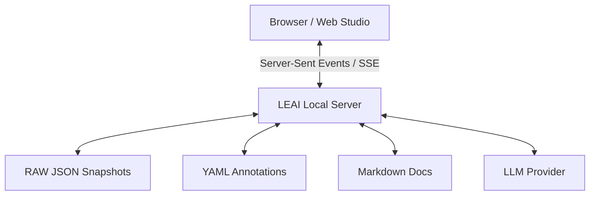

# LEAI Web Documentation & Annotation Studio

The **LEAI Web Studio** is an interactive, browser-based visual workspace that turns your Oracle database metadata into an actionable real-time collaboration hub.

---

## ⚡ Starting the Web Studio

To launch the local studio server:

```bash
leai serve
```

By default, LEAI starts the web daemon at `http://127.0.0.1:8891` and automatically opens your default browser.

### Parameters and Flags for `leai serve`

| Parameter / Flag | Type | Default | Description |
| :--- | :--- | :--- | :--- |
| `--port` | Option | `8891` | TCP port for the local web server. |
| `--host` | Option | `127.0.0.1` | Network interface to bind (e.g. `0.0.0.0` for intranet access). |
| `--open-browser / --no-open-browser` | Flag | `True` | Automatically launches default browser on startup. |
| `-c`, `--config PATH` | Option | `leai.yml` | Path to configuration file. |
| `-p`, `--provider TEXT` | Option | From config | Overrides active AI provider for the studio session. |

```bash
# Bind across internal network on custom port
leai serve --host 0.0.0.0 --port 9000 --no-open-browser
```

You can also launch directly into the Web Chat interface via:
```bash
leai chat --web
```

---

## 🎨 Studio Capabilities



1. **In-Browser Annotation Editor:** Update table descriptions, business rules, and column notes directly in your browser with immediate write-through to local YAML files.
2. **Instant 1-Click Recompilation:** Recompile the Markdown documentation for individual tables without triggering a full project rebuild.
3. **Interactive Mermaid Lineage Visualizer:** Inspect rendered dependency graphs with smooth zooming and panning.
4. **On-Demand AI Auto-Enrichment:** Generate business descriptions for empty stubs with a single button click.
5. **Streaming Web Chat Console:** Engage with the database copilot over real-time Server-Sent Events (SSE) with syntax highlighting and 1-click clipboard code copy.
6. **Cloud Synchronization with SeaweedFS S3:** Saving annotations in the browser writes to local disk and instantly uploads to Object Storage, with automatic remote fallback if local files are absent.

---

## ☁️ SeaweedFS / S3 Integration in Web Studio

When SeaweedFS storage is enabled in `leai.yml`, Web Studio turns on native cloud storage capabilities:

* **Header Connection Badge:** The top navigation bar displays a live indicator `☁️ S3: <bucket-name>`, verifying that Web Studio is connected to Object Storage.
* **Immediate S3 Write-Through on Save:** Clicking *Save Annotations* (`POST /api/annotations`) persists the YAML file under `annotations/` and instantly syncs it to the remote S3 bucket under the configured prefix. The toast notification confirms the remote sync (`☁️ Synced to SeaweedFS`).
* **Transparent Read Fallback (`GET /api/object`):** When opening an object in the web UI whose local YAML annotation does not yet exist, the server automatically queries SeaweedFS, fetches the remote annotation, hydrates local cache, and populates the editor.
