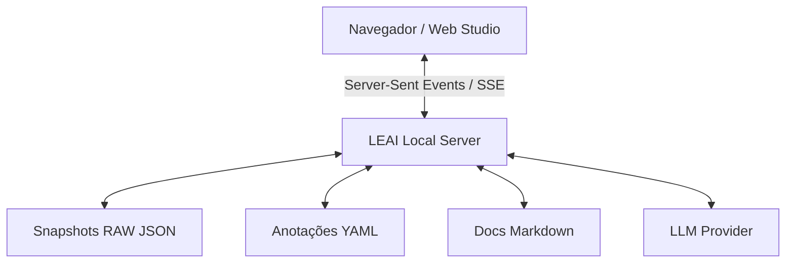

# LEAI Web Documentation & Annotation Studio

O **LEAI Web Studio** é um ambiente visual interativo executado no navegador que transforma a documentação do Oracle em um estúdio colaborativo em tempo real.

---

## ⚡ Como Iniciar o Web Studio

Para iniciar o servidor local do estúdio:

```bash
leai serve
```

Por padrão, o LEAI iniciará o servidor em `http://127.0.0.1:8891` e abrirá o navegador automaticamente.

### Parâmetros e Opções do Comando `leai serve`

| Parâmetro / Flag | Tipo | Padrão | Descrição |
| :--- | :--- | :--- | :--- |
| `--port` | Opção | `8891` | Porta TCP para escuta do servidor web. |
| `--host` | Opção | `127.0.0.1` | Endereço de interface de rede para vincular o servidor. |
| `--open-browser / --no-open-browser` | Flag | `True` | Abre automaticamente o navegador padrão ao iniciar. |
| `-c`, `--config PATH` | Opção | `leai.yml` | Caminho para o arquivo de configuração. |
| `-p`, `--provider TEXT` | Opção | Do config | Sobrescreve o provedor de IA utilizado pelo estúdio. |

```bash
# Executar em porta customizada para toda a rede local
leai serve --host 0.0.0.0 --port 9000 --no-open-browser
```

Também é possível iniciar o chat web diretamente pelo comando `chat`:
```bash
leai chat --web
```

---

## 🎨 Funcionalidades do Web Studio



1. **Editor de Anotações em Tempo Real:** Edite descrições de tabelas, regras de negócio e comentários de colunas diretamente no navegador com salvamento imediato nos arquivos YAML locais.
2. **Recompilação Instantânea em 1 Clique:** Recompile a documentação Markdown de qualquer objeto individualmente sem precisar rodar `leai compile` completo.
3. **Visualizador de Diagramas Mermaid:** Veja o grafo de linhagem e dependências renderizado interativamente com zoom e pan.
4. **Enriquecimento com IA sob Demanda:** Botão para solicitar ao modelo de IA sugestões de descrições e regras para colunas vazias.
5. **Console de Chat Web com Streaming:** Converse com o agente do banco via interface web moderna, com streaming de respostas (SSE) e formatação de blocos de código com cópia em 1 clique.
6. **Sincronização em Nuvem com SeaweedFS S3:** Ao salvar qualquer anotação no navegador, o Web Studio persiste no disco local e envia simultaneamente para o Object Storage, além de buscar anotações remotas caso não existam no cache local.

---

## ☁️ Integração com SeaweedFS / S3 no Web Studio

Quando o SeaweedFS está configurado e habilitado no `leai.yml`, o Web Studio ativa recursos integrados de nuvem:

* **Badge de Conexão no Cabeçalho:** O topo da página exibe o indicador `☁️ S3: <nome-do-bucket>`, confirmando que o estúdio está conectado ao Object Storage.
* **Salvamento com Sincronização S3 Imediata:** Ao clicar em *Salvar Anotações* (`POST /api/annotations`), o servidor salva o arquivo YAML em `annotations/` e realiza o upload imediato para o bucket S3 remoto no prefixo configurado. O toast de notificação confirma a sincronização (`☁️ Sincronizado com SeaweedFS`).
* **Fallback Transparente na Visualização (`GET /api/object`):** Se um objeto for aberto no navegador e ainda não possuir arquivo YAML local correspondente, o servidor busca automaticamente a versão existente no bucket SeaweedFS, hidrata o cache local e exibe o formulário preenchido.
